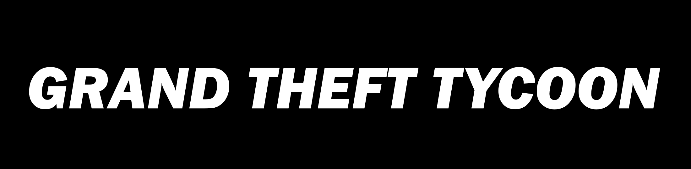
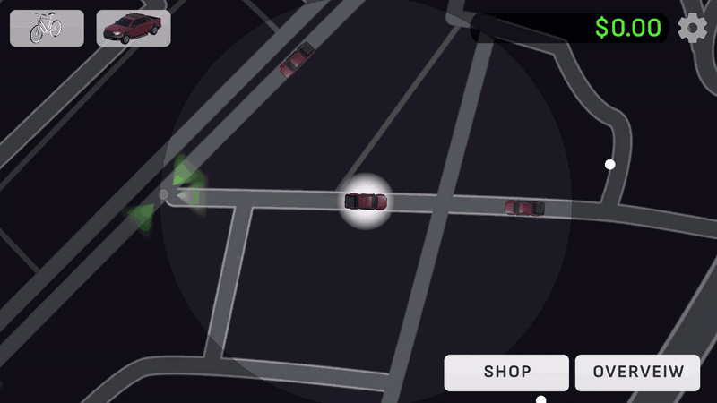
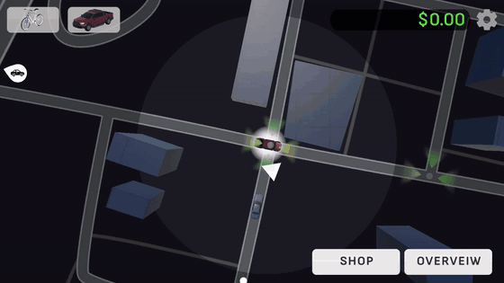
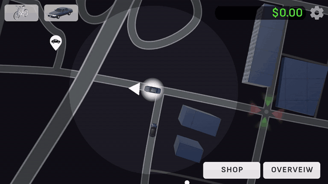
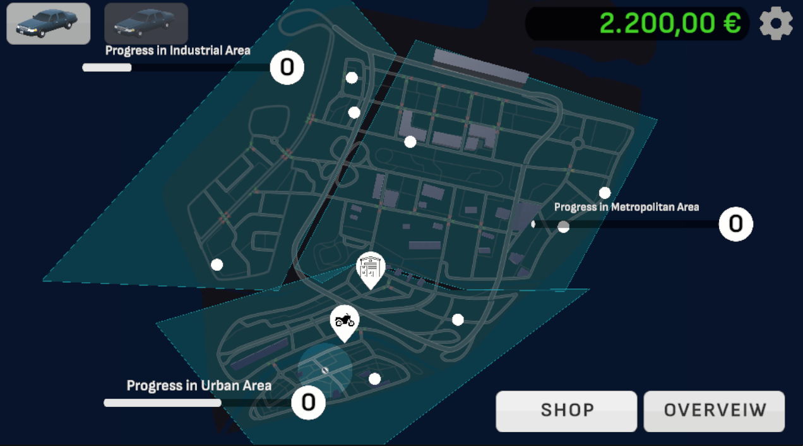
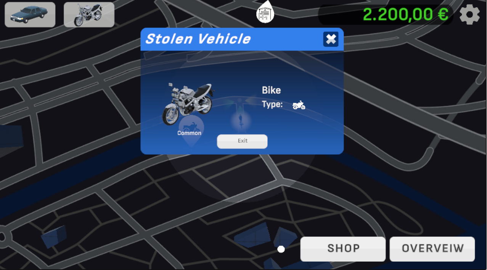

  

  <strong>Find your next ride. Make the sale. Build your car collection.</strong> 
  A city of cars, buyers, and opportunities — controlled with a drag of your mouse or finger.

  <a href="https://ivanpavlov.itch.io/grand-theft-tycoon"><strong>▶ Play on itch.io</strong></a>
  &nbsp; · &nbsp;
  <a href="https://www.youtube.com/watch?v=_lktZHBXzlA">Watch the showcase</a>
  &nbsp; · &nbsp;
  <a href="docs/getting-started.md">Run the project</a>
  &nbsp; · &nbsp;
  <a href="docs/README.md">Documentation</a>

<strong>Unity 6</strong> · C# · HTML5 prototype · Mouse & touch

## A small car hustle with bigger ambitions

**Grand Theft Tycoon** is a car theft and trading simulation by **Ivan Pavlov**. Explore a stylized city, pick up other vehicles, find interested buyers, and turn your trips into money. Spend your earnings on personal rides, switch your vehicle in the shop, or stash a rare find for later.

The prototype makes the city your playing board: inspect an object, drag your car toward an opportunity, and decide what to do next.

| Find a car | Make the sale |
| :---: | :---: |
|  |  |
| Drag your current ride onto another vehicle. | Bring the car to a buyer interested in its type. |

## What you can do

- **Explore the city:** follow its roads and inspect cars, destinations, and opportunities.
- **Steal and sell:** take another vehicle and deliver it to a matching buyer.
- **Upgrade your personal ride:** purchase vehicles and switch between them in the shop.
- **Keep a collection:** stash stolen cars instead of selling every find.
- **Track your progress:** use the overview to see the city's areas and progression.

<strong>Take a closer look at the city</strong>

| City overview | Your latest find |
| :---: | :---: |
|  |  |

## How to play

| Action | Control |
| --- | --- |
| Inspect an object | Click or tap it. |
| Move your current vehicle | Drag it with the mouse or your finger. |
| Take another car | Drag your vehicle onto it. |
| Interact with a destination | Drag the vehicle onto its objective. |
| Sell a stolen car | Deliver it to a buyer who wants that vehicle type. |
| Buy or switch personal vehicles | Visit the vehicle shop. |
| Save a car for later | Take it to the stolen-car stash. |

You return to your personal vehicle when you leave a stolen one. The interaction is designed around pointing and dragging; keyboard bindings in the Unity project also include [developer cheats and debug controls](docs/getting-started.md#developer-cheats-and-debug-controls), including 10× simulation speed.

## Project status

This is a **prototype in development**. The [itch.io page](https://ivanpavlov.itch.io/grand-theft-tycoon) is the public entry point; these previews come from the project's recorded showcase and screenshots.

The repository also contains warehouse disassembly, police AI, collectibles, missions, and road-authoring tools. Their presence in the source does not mean every system is enabled in the public build or the selected game configuration. See the [architecture guide](docs/architecture.md) for the current structure.

## Run it in Unity

1. Install **Unity 6000.3.25f1**, the version recorded in `ProjectSettings/ProjectVersion.txt`.
2. Add this repository's root folder to Unity Hub and open it.
3. Let Unity restore packages and finish importing assets.
4. Open `Assets/CarSeller/Scenes/Intro.unity` and press **Play**.

The Intro scene loads **City Scene** at build index 1. Keep Intro first and City Scene second in the active build scene list. For prerequisites, scene variants, Web builds, and troubleshooting, read [Getting started](docs/getting-started.md).

## Documentation

| Guide | What's inside |
| --- | --- |
| [Getting started](docs/getting-started.md) | Editor setup, dependencies, scenes, controls, builds, troubleshooting. |
| [Architecture](docs/architecture.md) | Bootstrap, city model, products, transactions, interaction, game systems. |
| [Development](docs/development.md) | Configuring gameplay, authoring roads, adding vehicles, running existing tests. |
| [Media](docs/media/README.md) | Preview sources and reproducible GIF exports. |
| [Credits](docs/credits.md) | Creator, artwork, icon and vehicle-model sources. |

Most game code lives in [`Assets/CarSeller`](Assets/CarSeller). [`Assets/CommonScripts`](Assets/CommonScripts) contains shared runtime utilities and editor tools. The `CarSeller` naming reflects the project's earlier working name.

## Credits

**Art, programming, and design:** [Ivan Pavlov](https://ivanpavlov.itch.io/). Built with Unity and additional third-party assets and tools; see [Credits](docs/credits.md).

## License

Original code and documentation are licensed under the [MIT License](LICENSE), copyright © 2026 Ivan Pavlov. Game artwork and other non-code assets are excluded; original artwork remains all rights reserved, and third-party content retains its own licenses. See [Licensing](LICENSING.md) for the scope and existing third-party notices.
