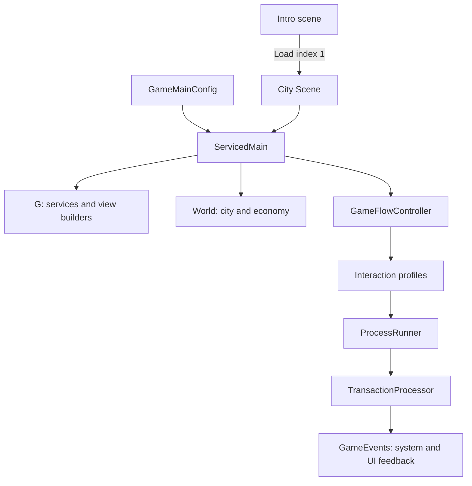

# Architecture

[Documentation](README.md) · [Getting started](getting-started.md) · [Development](development.md)

The main runtime is the `CarSeller` assembly in [Scripts/Runtime](../Assets/CarSeller/Scripts/Runtime). It combines C# models, ScriptableObject configuration, scene MonoBehaviours, and UI/view builders. `G` is its central service locator. Older implementations remain alongside newer services.

## Bootstrap and scene flow



1. [IntroScene](../Assets/CarSeller/Scripts/Runtime/Systems/Intro/IntroScene.cs) loads scene index 1 asynchronously.
2. [ServicedMain](../Assets/CarSeller/Scripts/Runtime/Global/Main/ServicedMain.cs) initializes services, resets events/static state, creates the world and sets FreeRoamGameState.
3. [GameMainConfig](../Assets/CarSeller/Scripts/Runtime/Global/Main/GameMainConfig.cs) supplies GameConfig and view builders. Its asset is `Resources/ScriptableObjects/[Main]/GameMainConfig.asset`.
4. [G](../Assets/CarSeller/Scripts/Runtime/Global/Main/G.cs) exposes world state, configs, services, and scene/UI managers.
5. [GameFlowController](../Assets/CarSeller/Scripts/Runtime/Global/GameFlowController.cs) switches state and loads city/warehouse scenes. [CitySceneMain](../Assets/CarSeller/Scripts/Runtime/Global/Main/CitySceneMain.cs) enters and initializes the city view.

The current singleton selects `[SimplifiedGP]GameplayConfig`. Other bootstrap configs represent alternative experiments. The obsolete GameFlowManager retains commented workflows; trace live interaction profiles and process classes for current behavior.

## Code map

| Area under Scripts/Runtime | Responsibility |
| --- | --- |
| [Core/Model](../Assets/CarSeller/Scripts/Runtime/Core/Model) | World, player, products, parts, ownership and locations. |
| [Core/Economy](../Assets/CarSeller/Scripts/Runtime/Core/Economy) | Economy config, prices, offers and starting possessions. |
| [Core/Operations](../Assets/CarSeller/Scripts/Runtime/Core/Operations) | Rules, offers, transactions, warehouse entry/exit and purchases. |
| [Global](../Assets/CarSeller/Scripts/Runtime/Global) | Bootstrap, shared services, game state, interactions and processes. |
| [Systems](../Assets/CarSeller/Scripts/Runtime/Systems) | City, police, warehouses, buyers, vehicles, missions and other gameplay. |
| [UI](../Assets/CarSeller/Scripts/Runtime/UI) | UI models, widgets, context menus, HUD and feedback. |
| [ToSort](../Assets/CarSeller/Scripts/Runtime/%5BToSort%5D) | Balancing, progression and other code awaiting organization. |

[Scripts/Editor](../Assets/CarSeller/Scripts/Editor) contains authoring tools and validators. [CommonScripts](../Assets/CommonScripts) contains shared audio, transparency, coroutine and singleton helpers plus editor tools.

## City and roads

[CityConfig](../Assets/CarSeller/Scripts/Runtime/Systems/City/Model/CityConfig.cs) references graph data, spatial-grid configuration, warehouses, stashes and initial spawns. Authoring components represent nodes, spline edges, markers, polygon areas and traffic lights.

[CityGraphAsset](../Assets/CarSeller/Scripts/Runtime/Systems/City/Authoring/CityGraphAsset.cs) stores IDs, directionality, spline references, marker anchors, area geometry and authoring linkage. An editor baker creates it from scene components. The runtime loads it into the city model. CityEntity represents a subject on the road graph; aspects add behavior such as visibility. Presenters and builders create views, while vision/fog systems track visibility and discovery.

## Cars and parts

Cars are products with a frame and slots. Engines, wheels and spoilers are products in their own right.

```text
Base config + optional variant
              ↓
        Config resolver
              ↓
        Runtime config
              ↓
        ProductBuilder
              ↓
    Product model + view builder
```

[GenericConfigResolver](../Assets/CarSeller/Scripts/Runtime/Core/Model/Product/Model/ConfigResolvers/Generic/GenericConfigResolver.cs) chooses a base or variant fallback, copies fields and applies enabled overrides. [CarConfigResolver](../Assets/CarSeller/Scripts/Runtime/Core/Model/Product/Model/ConfigResolvers/CarConfigResolver.cs) resolves the frame and slots. [ProductBuilder](../Assets/CarSeller/Scripts/Runtime/Core/Model/Product/Model/ProductBuilder/ProductBuilder.cs) creates the car and occupying parts.

ProductLifetimeService, ProductLocationService and OwnershipResolutionService support lifecycle, relocation and ownership. Reuse those services when extending product behavior.

## Interactions, processes and transactions

[InteractionController](../Assets/CarSeller/Scripts/Runtime/Global/Interaction/InteractionController.cs) routes clicks, drags and triggers through the current IInteractionManager. Context-menu and trigger profiles vary by game state. City profiles cover neutral, free-roam, stealing, selling and mission states; warehouses have their own profiles.

A drag-end onto a buyer starts [BuyerProcess](../Assets/CarSeller/Scripts/Runtime/Systems/Buyers/BuyerProcess.cs). It checks sale rules, runs SellTransaction and returns control from the world vehicle. Buyers reject personal cars and mismatched vehicle types. Shop and warehouse operations also use process classes.

[TransactionProcessor](../Assets/CarSeller/Scripts/Runtime/Core/Operations/Transactions/Presenter/TransactionProcessor.cs) dispatches by concrete transaction type, finalizes the result and emits OnTransactionComplete. Handler registration is in G.Initialize. Active registrations include purchase, sale, reward, stripping, pulling a car from a warehouse and putting products into a holder. Other transaction classes exist without registered handlers.

[GameEvents](../Assets/CarSeller/Scripts/Runtime/Systems/Game%20Events/GameEvents.cs) carries gameplay notifications. Pair subscriptions with unsubscriptions so listeners survive scene changes and resets.

## Configuration and feature availability

[GameConfig](../Assets/CarSeller/Scripts/Runtime/Global/Main/GameConfig.cs) connects city, economy, missions, vehicles, balancing, palette and optional mode data. Balancing includes area definitions, levels, car types, rarities and global values, with spreadsheet-import support.

| System in source | Where to inspect |
| --- | --- |
| Buyers and selling | Systems/Buyers, Core/Economy/CarSelling, transaction handlers. |
| Personal rides and shop | Systems/PersonalVehicles and vehicle config. |
| Warehouses and disassembly | Systems/Warehouse, CarMechanicService, entry/exit processes. |
| Traffic and lights | Systems/City/Authoring, presenters and traffic-light views. |
| Police | Systems/Police, Systems/AI/PoliceAISystem.cs. |
| Collectibles | Systems/FreeRoam/CollectablesManager.cs. |
| Missions | Systems/Missions, configuration and event bus. |
| Progression | ToSort/AreaProgressionManager.cs and related UI. |

Availability depends on config references, scene components, initialization and events. A system's presence in source is not evidence that it is enabled in the public prototype.

